# 아트 호라이즌 (Art Horizon)

## [아트 호라이즌](https://art-horizon-fe.vercel.app/)


## 0. 목차

1. 소개
2. 사용 기술
3. 개발 기간과 구성원
4. 성과
5. 느낀 점
6. 구현 페이지 목록
7. 기타 구현 목록
8. 동작 GIF 모음

## 1. 소개

- 아트 호라이즌 (Art Horizon)
- 온라인으로 미술 관람, 전시, 추천, AI 서비스
- 전시된 작품 목록을 탐색하거나 작품을 직접 업로드해 전시
- 작품 검색
- 작품 관람
  - 관람 모드
- 작품 업로드
  - AI가 작품에 대한 태그를 추천
  - 가격 지정 선택 가능
- AI 스타일 : 이미지를 업로드 하면, 본인이 좋아하는 작품의 스타일로 AI가 이미지를 변환
- 그림의 향 : 이미지를 업로드해 해당 이미지가 가진 향을 찾음

### 회원 관리

- 나의 작품, 북마크 작품 관리
- 팔로워, 팔로우
- 닉네임 변경
- 상태메시지 변경
- 비밀번호 변경
- 프로필 사진 변경
- 화가로 전환 기능
- 회원 탈퇴

## 2. 사용 기술

- React
- React Router : 라우팅 구현
- Redux Toolkit : 전역 상태 관리
- Axios : 서버와 네트워크 통신
- CSS
  - AOS : 컴포넌트 애니메이션
  - TailwindCSS : 전체적인 CSS
  - Styled Components : 부분적인 CSS div
  - React Icons : 아이콘
- React Toastify : 토스트 알림창
- Firebase : 파이어베이스 연동

```
"localforage": "^1.10.0",
"match-sorter": "^6.3.1",
"react-grid-system": "^8.1.6",
"sort-by": "^1.2.0",
"styled-reset": "^4.4.2",
```

## 3. 개발 기간과 구성원

### 개발 기간

- 2022년 8월 ~ 2022년 10월, 약 7주

### 구성원

- 총 6명
  - FE 2명, BE 2명, AI 2명
- FE (2명)
  - 함희주 (본인, 전체적인 구성, 이미지 업로드 제외 대부분)
  - 팀원 1명 (이미지 업로드 관련 기능)
- BE (2명)
- AI (2명)

## 4. 성과

## 5. 느낀 점

### 프로젝트 개발을 하고 전체적으로 느낀 점

- 2번째 리액트 프로젝트
- 전 프로젝트에서 학습했기 때문에, 초기 설정은 어렵지 않았음
  - 라우터나 전역 상태 관리, CSS 적용 등
- 작품을 전시하는 서비스라서 페이지 디자인, UI의 부드러운 상호작용, 애니메이션에 많이 신경을 씀
  - 페이지 이동시 나타나는 애니메이션
  - 기본적으로 밝은 느낌의 디자인을 사용하고, 그림 감상 페이지에서는 감상에 방해되지 않게 다크모드가 되도록 함
- 컴포넌트를 분리해서 기능을 나누어 개발하지 못한 것이 전체적으로 아쉬움
  - 2명이서 하기에는 시간이 많이 부족해서 기능 구현에만 급급함
- 페이지마다 반복되는 로직이 있어
- 시맨틱 태그를 신경쓰지 못한 부분이, 프로젝트를 끝낸 후 눈에 들어와서 아쉬움

## 6. 구현 페이지 목록

각 페이지 구현하며 생긴 고민과 해결도 포함

1. 홈 (`/`)
2. 로그인 (`/login`)
3. 회원가입 (`/signup`)
4. 마이페이지 (`/mypage/:userId`)
5. 회원정보 수정 (`/usermodify`)
6. 작품 목록 (`/pieces`)
7. 그림 등록 (`/register`)
8. 작품 상세 (`/pieces/:pieceId`)
9. AI 스타일 (`/style`)
10. 그림의 향 (`/scent`)

### 1. 홈 (`/`)

|                                                                                                                              |                                                                                                                      |
| :--------------------------------------------------------------------------------------------------------------------------: | :------------------------------------------------------------------------------------------------------------------: |
|     홈페이지 - 작품 목록 버튼, 작품 업로드 버튼      |              홈페이지 - 작품 추천 태그 소개 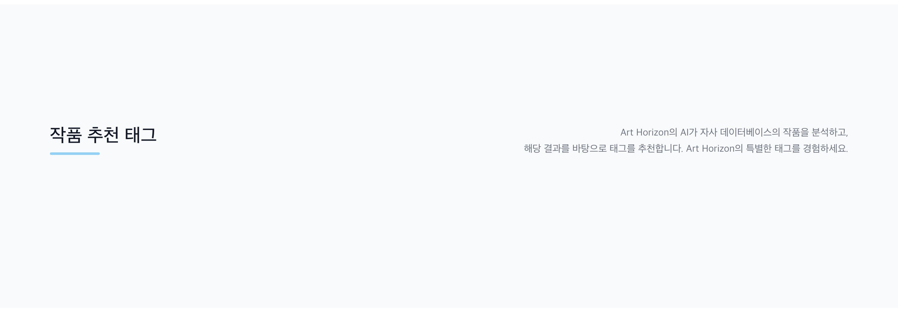              |
|            홈페이지 - AI 스타일 소개, 시작 버튼 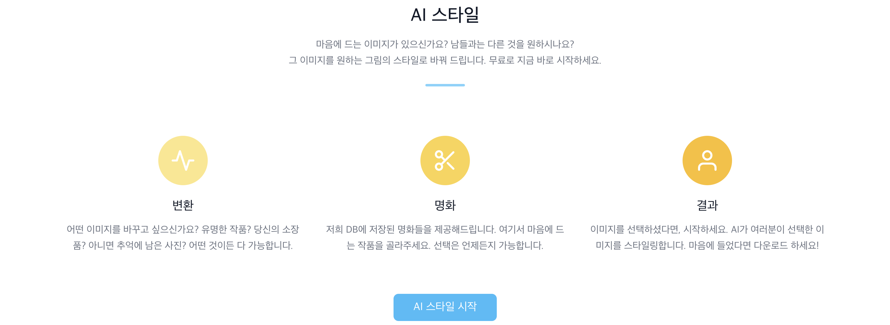            | 홈페이지 - 그림의 향의 종류 소개, 탐색 버튼 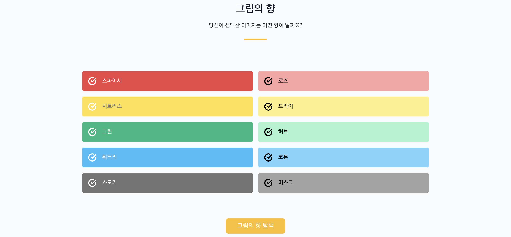 |
| 홈페이지 - 화가 소개, 화가 마이페이지 이동 링크 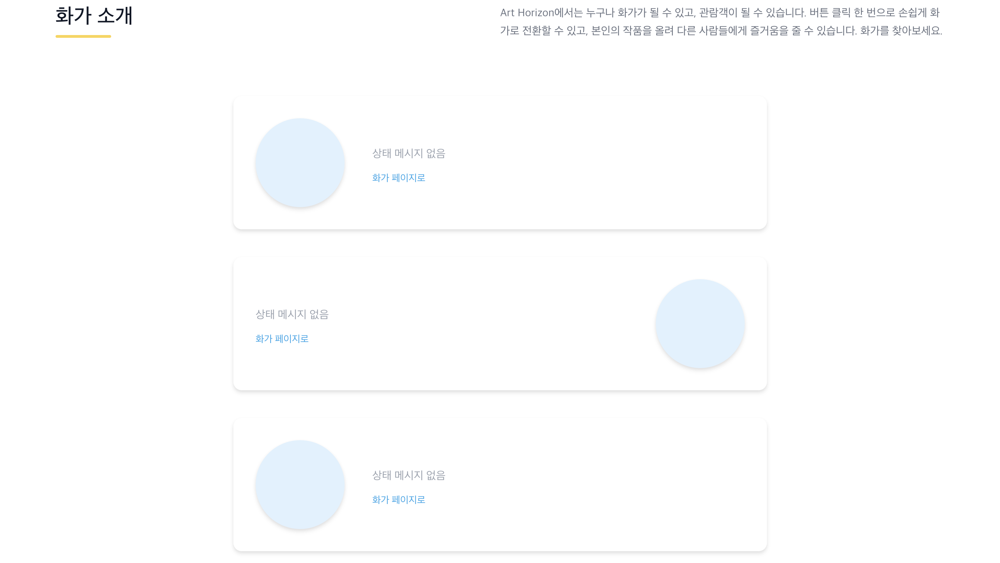 |          홈페이지 - 아트 호라이즌 사용 후기 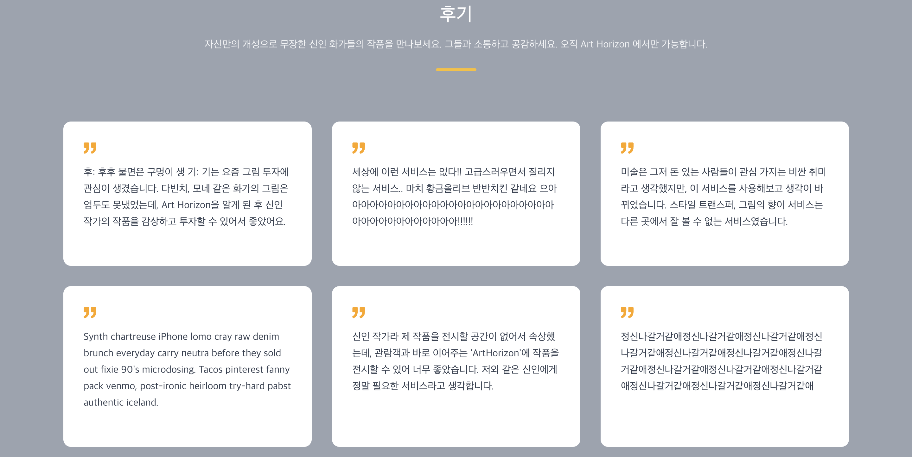          |

기능

- 아트 호라이즌 서비스의 홈 페이지
- 어떤 기능이 있는지 소개하고, 제시된 버튼과 링크로 해당 서비스로 바로 이동
- 작품 추천 태그
- AI 스타일
- 그림의 향
- 화가
- 후기

고민

1. 서비스를 처음 이용할 때 보이는 화면이기 때문에 디자인에 노력을 기울임
2. 전반적인 서비스 소개를 목적으로 구성

해결

1. 스크롤을 내리면 컴포넌트가 애니메이션이 적용되어 생성됨
2.

### 2. 로그인 (`/login`)

|                                                               |                                                           |
| :-----------------------------------------------------------: | :-------------------------------------------------------: |
| 로그인 페이지 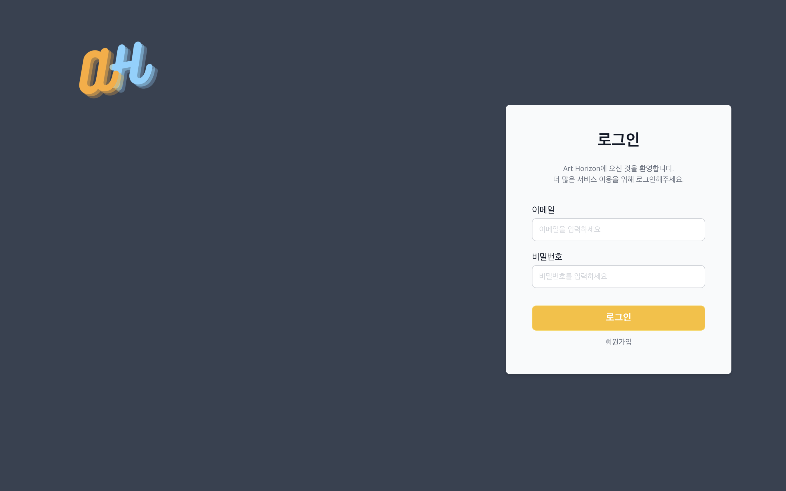 | 로그인 성공 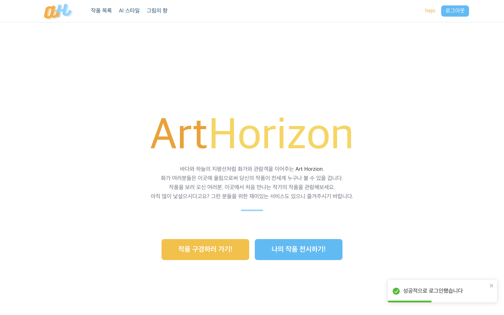 |

기능

- 컴포넌트 구성
  - `Login` : 로그인 페이지 자체. 서버에서 배경화면 이미지 가져옴
  - `LoginForm` : 폼 입력값 관리·검증, 서버 통신 컴포넌트
- 이메일, 비밀번호를 입력받아 로그인
- 입력값 검증
  - 입력 여부
  - 입력값이 유효하지 않으면 토스트에 에러 메시지 출력
- 로그인 성공
  - 전역 상태에 로그인 유저 정보 저장
  - 로컬 스토리지에 access token 저장
  - 로그인 성공 토스트 출력, 홈으로 리다이렉트
- 로그인 실패
  - 에러 토스트 출력

고민

1. `LoginForm` 컴포넌트에서 로그인 성공 시 유저 정보 갱신하는 부분이 길어짐
   - 코드가 길어지고 복잡해 질 우려가 있음
2. 입력창에 대한 `input` 태그를 쓰는데 중복되는 부분이 많음
3. 로그인 페이지 출력시 너무 정적이라서 사용하기가 싫어지는 느낌이 있음
4. `onChange` 에 핸들러 함수를 생성해서 이름을 붙일지, 그냥 화살표 함수만 전달할지 고민

해결

1. `dispatch`를 통해 로그인 성공 이후의 해당 로직을 Redux 쪽으로 넘김
   - `LoginForm` 컴포넌트는 입력값 관리만 하기
2. `Input` 컴포넌트를 만들고 따로 빼는 것이 좋아보임
   - 범용적인 디자인도 props로 넘길 수 있도록 하면 더욱 재사용성이 증가할 것 같음
3. 폼 렌더링에 AOS 애니메이션을 적용해서 상호작용하는 느낌이 많이 들도록 개선
   - 입력창 포커스할 때도 프로젝트 테마 색을 적용하고, 버튼 색도 동일하게 했으며 버튼 호버링·클릭시 색깔 변화 다양하게 만들어 사용자 경험 개선
4. 화살표 함수만 작성 했으나, 함수를 미리 정의하면 어떤 함수가 있는지 파악할 수 있기 때문에 괜찮아 보임

### 3. 회원가입 (`/signup`)

|                                                                                                    |                                                                                                                            |
| :------------------------------------------------------------------------------------------------: | :------------------------------------------------------------------------------------------------------------------------: |
| 회원가입 페이지, 중복확인 버튼 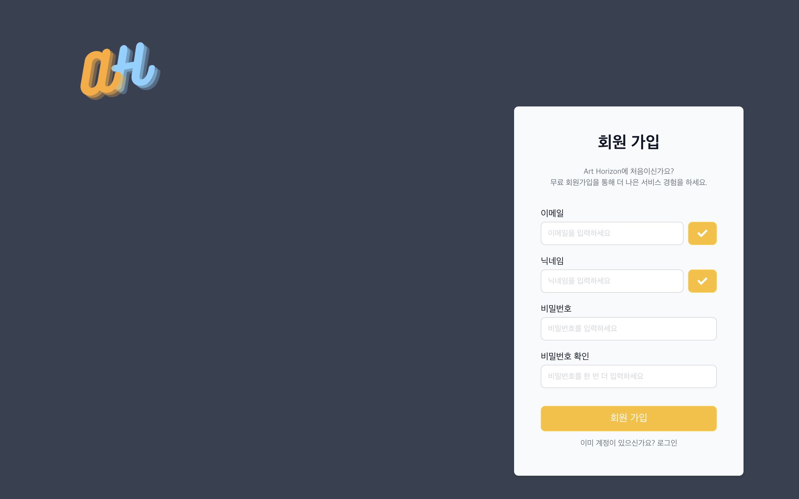 | 회원가입 성공시 로그인 페이지로 리다이렉트 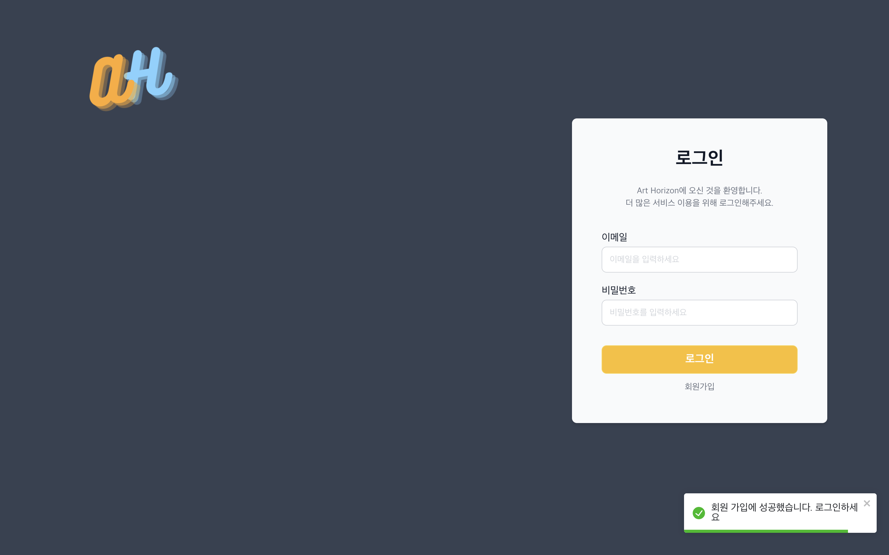 |

기능

- 컴포넌트 구성
  - `Signup` : 회원가입 페이지 자체. 서버에서 배경화면 이미지 가져옴
  - `SignupForm` : 폼 입력값 관리·검증, 서버 통신 컴포넌트
- 중복 확인한 이메일, 중복 확인한 닉네임, 비밀번호를 입력받아 회원가입
- 입력값 검증
  - 입력 여부, 중복 확인
  - 입력값이 유효하지 않으면 토스트에 에러 메시지 출력
- 회원가입 성공
  - 전역 상태에 회원가입 유저 정보 저장
  - 로컬 스토리지에 access token 저장
  - 회원가입 성공 토스트 출력, 로그인 페이지로 리다이렉트하고 로그인 요구
- 회원가입 실패
  - 에러 토스트 출력

고민

1. 다루는 입력값이 4가지라서 하나의 객체 state로 관리하려고 했지만, `setState` 함수가 길어져서 따로따로 4개의 state로 관리
   - `return` 부분이 길어지고 줄이 넘어가서 가독성이 떨어짐
2. 로그인 페이지와 동일하게 입력값 관리·검증은 `SignupForm`에서 다루고 서버와 통신하는 로직은 Redux의 reducer 함수가 처리할 수 있도록 함

해결

1. 화살표 함수에서는 객체를 리턴할 때는 소괄호로 감싸면 된다는 것을 이때는 몰랐음
   - 다음 프로젝트에서 이 부분을 적용할 수 있었음
2. `SignupForm`에서 처리하지 않고 데이터는 `Signup`에 전달하고, `Signup`에서 서버와 통신하는 것이 좋을 것 같음

### 4. 마이페이지 (`/mypage/:userId`)

|                                                                                         |                                                                                                        |
| :-------------------------------------------------------------------------------------: | :----------------------------------------------------------------------------------------------------: |
| 마이페이지 (본인의 마이페이지) 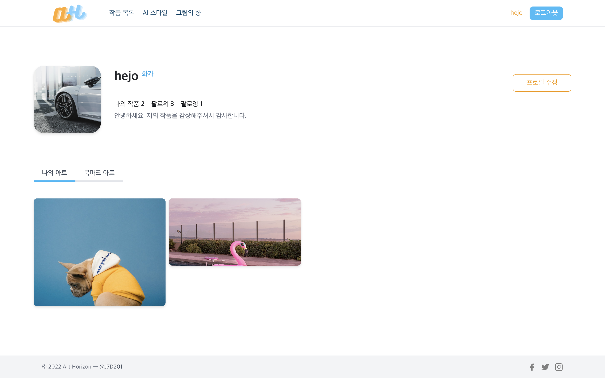 | 이미지 호버링시 제목, 작가 표시 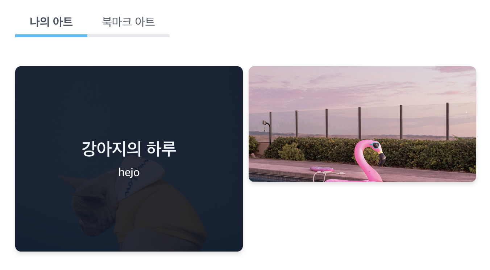 |

기능

- 컴포넌트 구성
  - `MyPage` : 마이페이지 페이지 자체. 하위 컴포넌트 구성만 함
  - `Info` : 유저 정보 출력, 팔로우·팔로우해제, 프로필 수정 버튼 컴포넌트
  - `Arts` : 그림 목록 출력 컴포넌트
- 아트 이미지 확인
  - 호버링하면 이미지가 어두워지며 제목과 작가 표시
  - 클릭하면 해당 이미지 정보 페이지로 이동
- 본인의 마이페이지
  - 북마크 아트 확인 가능
  - 프로필 수정 버튼
- 다른 유저의 마이페이지
  - 해당 유저의 북마크 아트 확인 불가
  - 팔로우 버튼. 팔로우 되어 있다면 팔로우 해제 버튼
- 화가 유저 : 닉네임 옆에 화가 표시
- 일반 유저 : 닉네임 옆에 일반 표시

고민

1. 이미지에 마우스를 갖다 대면 이미지가 어두워지고 이미지 정보가 표시되어야 함
   - `img` 태그에 CSS를 설정했지만 적용이 되지 않음
2. `MyPage` 컴포넌트가 단순히 하위 컴포넌트 구성만 하고 기능이 없어서 고민

해결

1. 이미지를 `img` 태그를 사용하지 않고 `div` 태그에 `backgroundImage` 스타일 부여
   - 백그라운드 이미지 `div`에 최하위 z-index를 주고, 이미지 정보가 있는 `div`에 최상위 z-index 부여
   - 이미지 정보 `div`에는 opacity 0을 주고, 마우스 호버링이 되면 opacity가 90이 되도록 함
   - 백그라운드 이미지를 맞추기 위해 cover 속성과 center 속성도 추가
   - 백그라운드 이미지에 대해 좀 더 이해하게 되었음
2. 컴포넌트에서 서버 통신, 상태 관리 등 모든 것을 담당
   - 코드가 길지 않았기 때문에 괜찮았던 것 같지만 나중에 어떻게 개선할 수 있을지 고민할 여지가 있음

### 5. 회원정보 수정 (`/usermodify`)

|                                                                                        |                                                                                |
| :------------------------------------------------------------------------------------: | :----------------------------------------------------------------------------: |
| 회원정보 수정 페이지 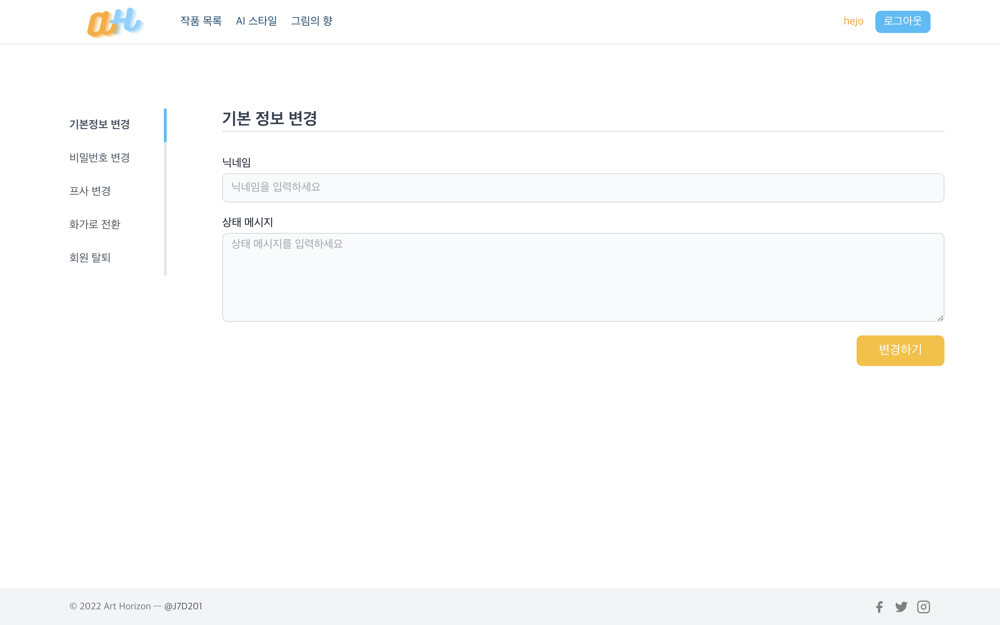 | 비밀번호 변경 탭 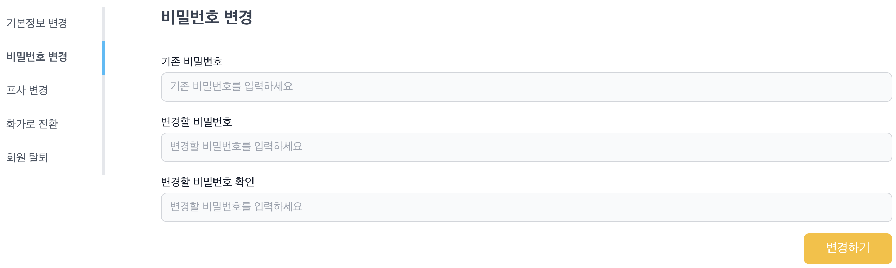 |
|  프로필 사진 변경 탭 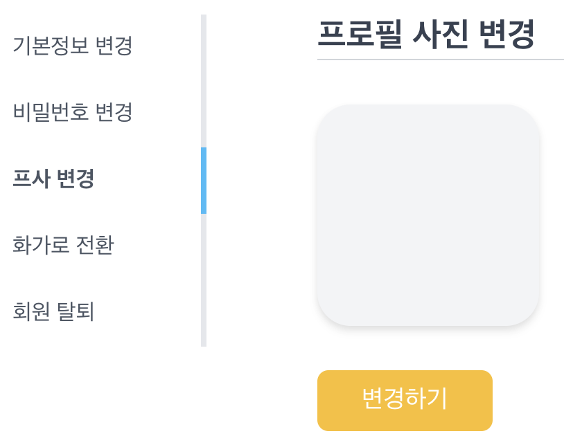  |   화가로 전환 탭 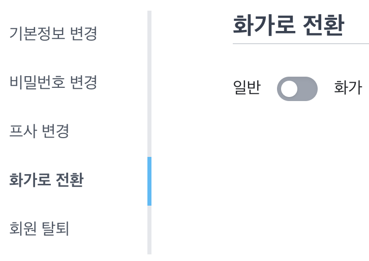   |
|         회원 탈퇴 탭 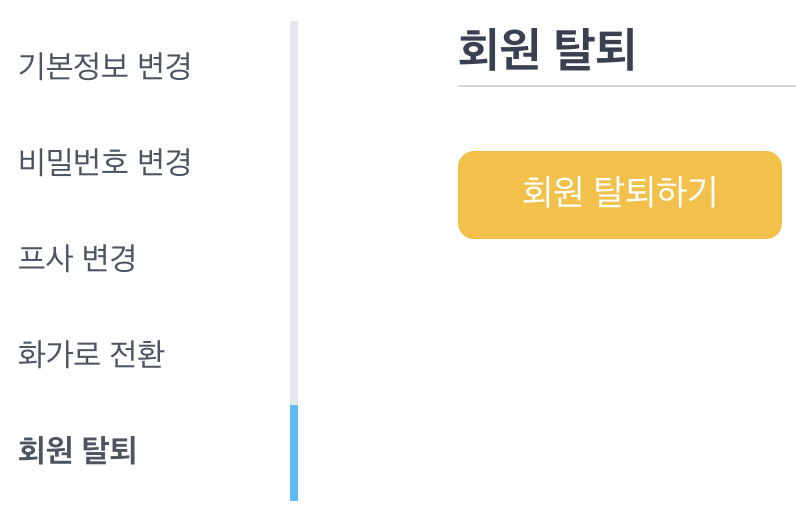         |                                                                                |

기능

- 컴포넌트 구성
  - `UserModify` : 선택된 탭이 무엇인지 state로 관리. 클릭된 탭의 컴포넌트를 출력
  - `Info` : 기본 정보 변경 컴포넌트
  - `Password` : 비밀번호 변경 컴포넌트
  - `ProfileImage` : 프로필 사진 변경 컴포넌트
  - `Convert` : 화가로 전환 컴포넌트
  - `Withdrawal` : 회원 탈퇴 컴포넌트
- 닉네임, 상태 메시지, 비밀번호, 프로필 사진 변경, 화가로 전환 기능, 회원 탈퇴
- 탭을 눌러 해당 컴포넌트만 보이기

고민

1. 좌측 탭을 눌렀을 때 오른쪽에 해당 탭의 내용을 출력하는데, 반응이 없고 밋밋해서 클릭하는 느낌이 떨어짐
2. 오른쪽 내용을 나타내는 컴포넌트가 스타일 적용된 `div`까지 포함할 것인지, `form` 까지만 포함할 것인지
3. 탭 컴포넌트 이름 앞에 페이지 이름인 `UserModify`를 붙일 것인지 고민
4. 오른쪽 공간이 너무 길어져서 고민
5. 회원정보 수정 로직을 탭 컴포넌트, Redux의 slice 함수 중에 어디에 맡길지 고민

해결

1. 선택한 탭에 대해 오른쪽에 파란 선이 나타나도록 CSS 적용하고 오른쪽 탭 내용에 등장 애니메이션 추가
   - 좀 더 직관적이고, 상호작용하는 느낌이 들도록 사용자 경험이 개선됨
   - 선택된 탭을 관리하는 컴포넌트를 따로 분리할까 고민했지만, 코드의 양이 많지 않아 `UserModify`에서 관리할 수 있게 작성함
2. 해당 `form`을 감싸는 `div` 까지 컴포넌트로 분리
   - `UserModify`에서 좀 더 깔끔하게 작성할 수 있음
3. 파일 이름이 너무 길어질 것 같아서 파일 이름 앞에 `UserModify`는 붙이지 않았음
   - 탭 컴포넌트는 usermodify 폴더 안의 components 폴더에 넣어 정리
4. 그에 맞춰 입력창도 길게 만들었음. 하지만 입력창이 너무 길어보여서 사용자에게 그 정도로 길게 입력해도 되겠다는 인상을 줄 것 같음
5. 개발 당시에는 `authSlice` 파일에 서버 통신과 응답 처리를 작성했는데, 지금은 잘 모르겠음

### 6. 작품 목록 (`/pieces`)

|                                                                                   |                                                                    |
| :-------------------------------------------------------------------------------: | :----------------------------------------------------------------: |
|      작품 목록 페이지 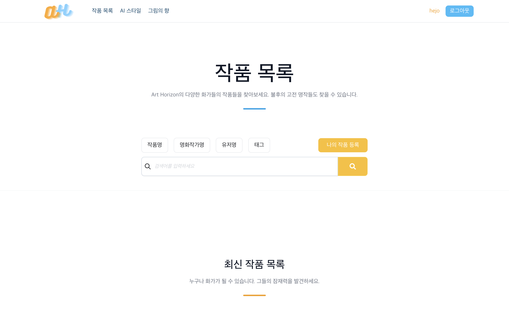       | 최신 작품 목록  |
| 검색 키워드(명화작가명) 클릭 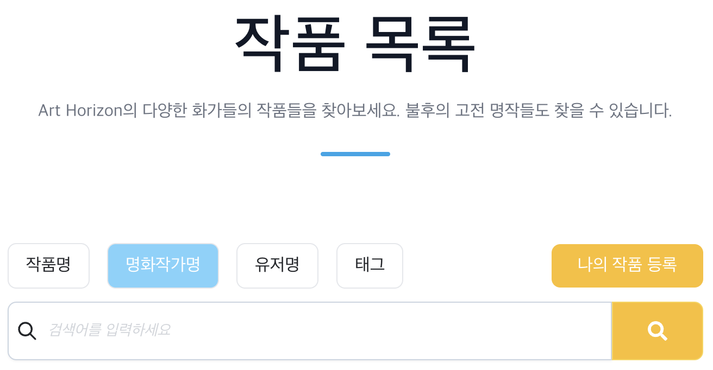 | 검색 결과 출력 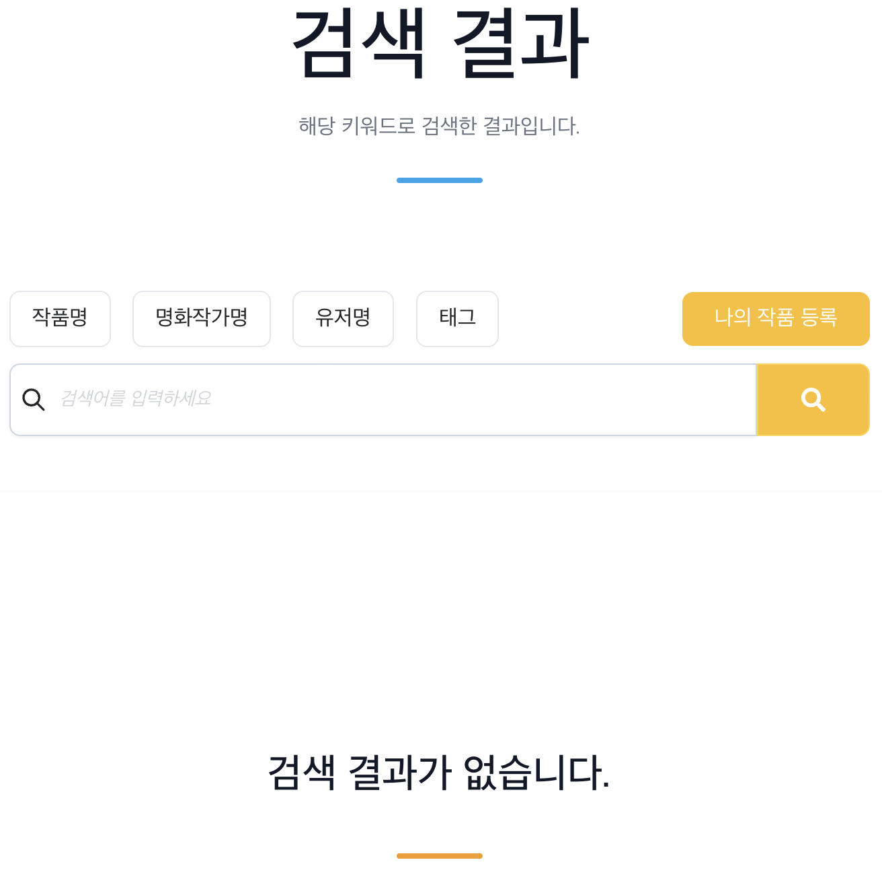 |

기능

- 컴포넌트 구성
  - `Pieces` : 작품 목록 페이지 자체
- 검색하지 않을 때
  - 최신 작품 목록 출력
- 검색할 때
  - 검색 키워드 (작품명, 명화작가명, 유저명, 태그) 하나 선택하고 검색
  - 검색 결과 이미지 출력

고민

1. 검색한 이미지를 어디에 나타내고 어떻게 나타낼 것인지
2. 어떤 단어를 검색했을 때, 해당 단어가 제목을 찾는 것인지 유저를 찾는 것인지 알 수 없음
3. 크기가 전부 다른 이미지를 어떻게 배치할 것인지
4. 무한 스크롤 구현

해결

1. 검색을 하지 않았을 때는 최신 작품 목록을 그대로 두고, 검색을 했을 경우(검색 폼에서 제출이 된 경우) 검색 상태를 나타내는 변수의 값을 변경해 최신 작품 목록 대신 검색 결과를 출력
   - `isSearched` 변수를 사용
2. 사용자가 선택할 수 있도록 검색 키워드 4가지의 버튼을 두고 클릭한 후 검색할 수 있도록 함
3. 다른 미술관 홈페이지나 전시 홈페이지를 조사해보며 파악
   - 이미지를 편집하지 않고 원래 사이즈 그대로 출력하는 경우가 있었지만, 디자인적으로 끌리지 않았음
   - 미리 네모 칸으로 정의해두고 불러온 이미지가 해당 칸을 최대한 채우게 함
4. 현재 사용자의 스크롤이 어디 위치인지 파악하고, 스크롤이 화면 아래 끝에 닿으면 불러오기 시작
   - 불러오기가 시작됐다면, 로딩 상태를 활성화하고 서버로부터 다음 페이지를 가져옴
   - 다음 페이지를 가져왔다면 로딩을 끝내고 화면에 출력
   - 구현에만 급급해 최적화를 하지 못한 것 같아 아쉬움
5. 시간에 쫓겨 컴포넌트 분리도 하지 못하고 하나의 컴포넌트에 모든 기능을 작성해서 아쉬움

### 7.

|                                                                                    |                                                                                        |
| :--------------------------------------------------------------------------------: | :------------------------------------------------------------------------------------: |
| 그림 등록 페이지 위쪽  | 그림 등록 페이지 아래쪽 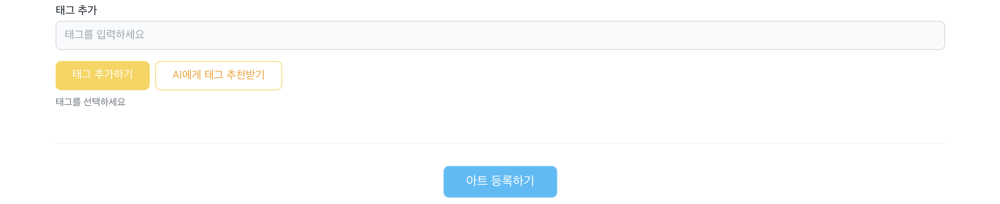 |
|        판매 가격 입력 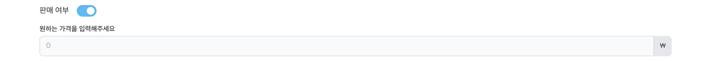        |          태그 입력·선택 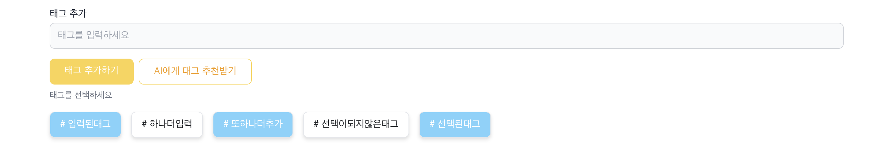          |

기능

- 컴포넌트 구성
  - `Register` : 그림 등록 페이지 자체
- 자신의 작품(이미지)을 업로드
  - 제목
  - 설명 (선택)
  - 판매 여부 (선택) : 활성화시 가격 입력
  - 태그
    - 입력해서 태그 추가. 클릭해서 활성화된 태그만 등록됨
    - 이미지가 업로드 되었다면, AI에게 태그 추천받기 버튼을 눌러 추천받을 수 있음

고민

해결

### 8. 작품 상세 (`/pieces/:pieceId`)

|                                                                         |     |
| :---------------------------------------------------------------------: | :-: |
| 작품 상세 페이지  |     |

기능

- 컴포넌트 구성
  - `Piece` : 작품 상세 페이지 자체
- 해당 작품의 이미지 출력
- 제목, 작가명, 날짜, 카테고리 등
- 해당 작품의 향 (분위기)
- 북마크 버튼을 클릭해 북마크, 다시 클릭해 북마크 해제
- 작품 결제 버튼
- 작품 목록 돌아가기 버튼
- 작품 이미지 클릭시 시네마 모드 (우측 설명 없이 화면에 이미지가 꽉 차게 나와 감상에 도움)

고민

1. 서버에서 받아 온 JSON 데이터의 키-값 쌍이 22개나 되어 다루기가 쉽지 않았음
2. 한 컴포넌트 안에서 다루는 기능이 너무 많아 코드를 관리하고 수정하는 것이
3. 이미지를 출력하는 부분이 많아서 성능에는 문제가 없는지 고민이 됨

해결

1. 해당 키-값 에서도 관련있는 것들은 다시 키-값으로 묶었으면 좋았을 것 같음
   - 다음 프로젝트 때는 백엔드 팀원과 더 많이 소통해서 해결하고 싶음
2. 기능별로 컴포넌트화 하는 것이 정말 중요하다는 것을 절실히 느낌
   - 프로젝트 발표가 얼마 남지 않았고 업무가 과중했기 때문에, 일단 기능 구현을 하겠다는 목적으로 컴포넌트를 분리하지 않고 개발했지만, 나중에 코드를 다시 살펴보니 이해하기 힘들었음
3. 배경에도 이미지를 출력하고, 설명창 왼쪽에도 이미지, 클릭 시에도 이미지를 출력해야 함
   - 또한 `backgroundImage`와 `img` 태그를 같이 사용했기 때문에 2배로 코드를 작성함
   - 향후 이미지를 다룰 때 더 나은 방법을 찾아야겠다고 다짐

### 9.

|                                                                                       |                                                                                                 |
| :-----------------------------------------------------------------------------------: | :---------------------------------------------------------------------------------------------: |
|          AI 스타일 페이지 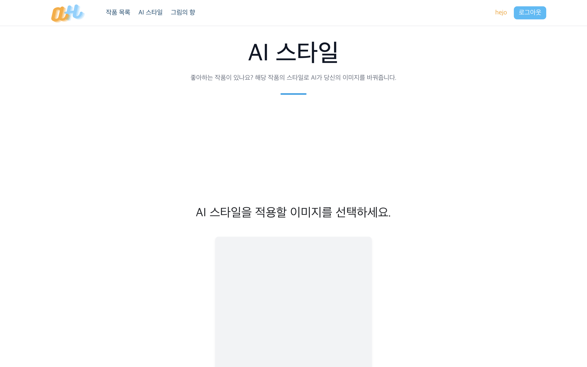          | AI 스타일을 적용할 이미지 선택  |
| 바꿀 스타일의 이미지 선택 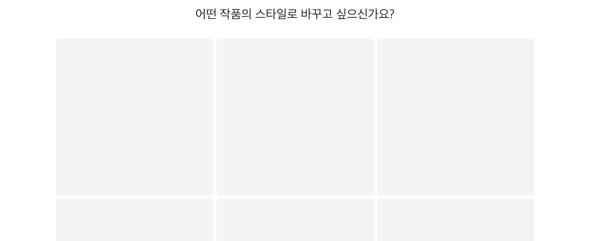 |               AI 스타일링 실행 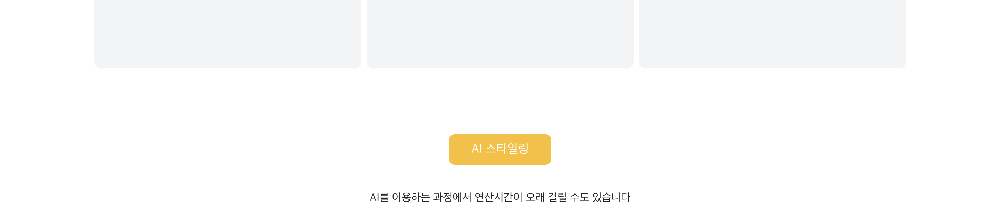               |

기능

- 컴포넌트 구성
  - `StyleTransfer` : AI 스타일 페이지 자체
- 이미지를 업로드하고, 해당 이미지에 AI 스타일링을 적용한 이미지를 다운로드 받을 수 있음
- 주어지는 6개의 이미지 중 하나의 이미지를 골라, 해당 이미지를 AI가 분석해서 화풍을 추출
- 업로드한 이미지에 해당 화풍을 적용

고민

해결

### 10. 그림의 향 (`/scent`)

|                                                                     |                                                                     |
| :-----------------------------------------------------------------: | :-----------------------------------------------------------------: |
| 그림의 향 페이지 1 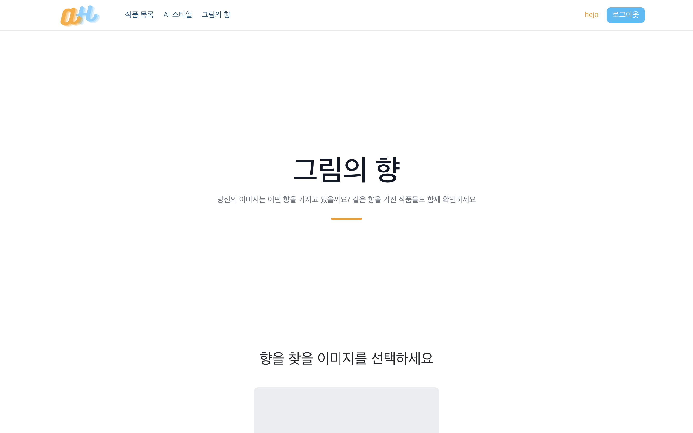 | 그림의 향 페이지 2 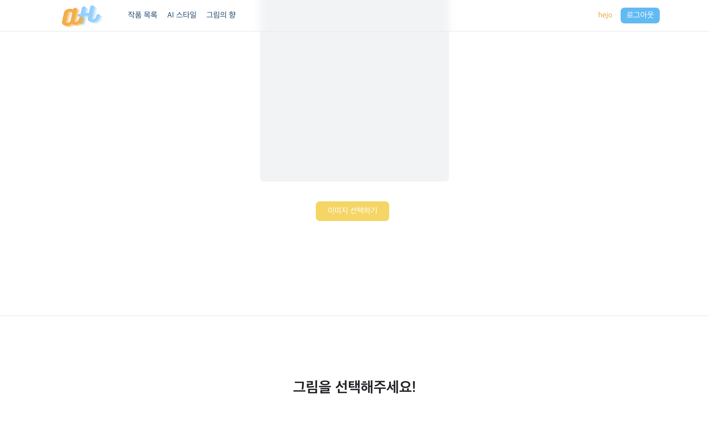 |

기능

- 컴포넌트 구성
  - `Scent` : 그림의 향 페이지 자체
- 이미지를 업로드하고, 해당 이미지를 AI 분석해 어떤 향이 나는지 표현

고민

해결

## 7. 기타 구현 목록

1. 내비게이션 바
   - 로그인·회원가입 페이지, 작품 감상 페이지, 나머지 페이지의 내비게이션 바가 다름
   - 내비게이션 바의 종류가 많아서 따로 구현했는데, 공통된 부분을 합쳐 구현했으면 더 좋았을 것 같음
2. 라우터
   - Protected·Private 라우트 적용
3. 로그인 유무
   - 로컬 스토리지에 Access Token을 저장
4. Redux-Toolkit
   - 전역 상태 관리 : 현재 로그인한 유저 정보와 상태

## 8. 동작 GIF 모음

[동작 GIF 모음]()

[프로젝트 상세·소감](https://sable-exhaust-9f0.notion.site/Art-Horizon-44fa76e6f3a34077a7f10684db6ec7ac)

- README로 이동 완료
